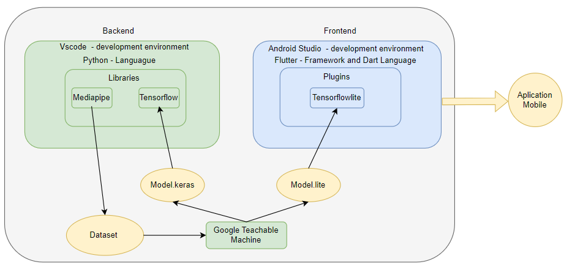
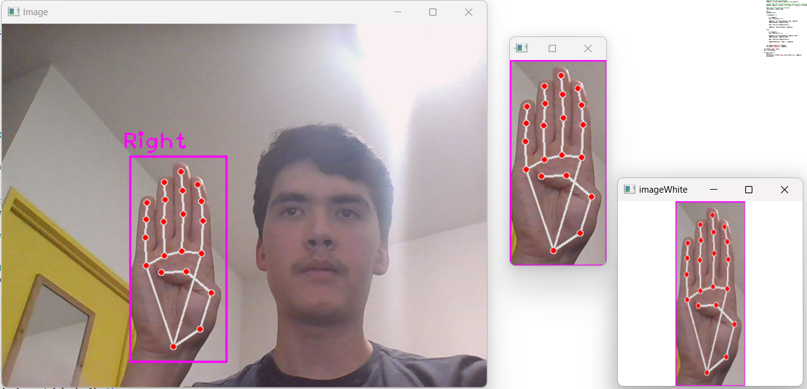
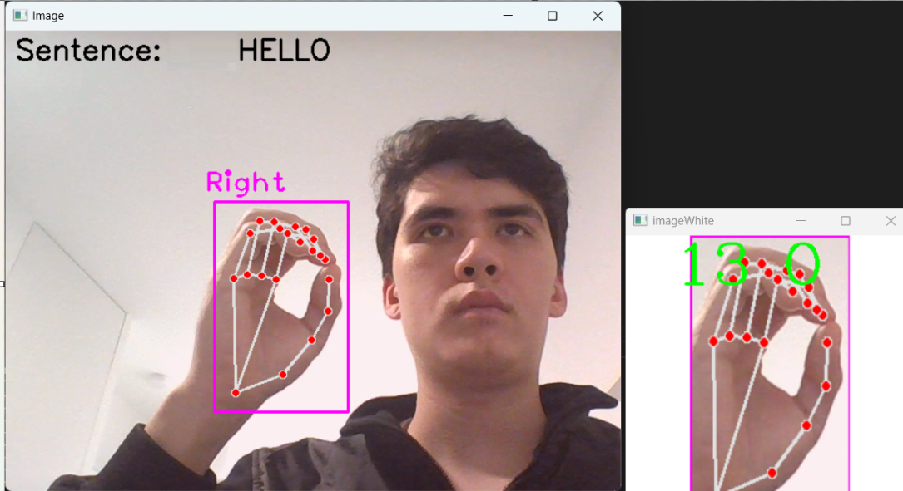

#  Sign Language Recognition Mobile Application

## Overview

This project aims to develop a **cross-platform mobile application (Android/iOS)** capable of recognizing **static sign language letters in real-time** using the device’s camera and displaying the corresponding text on the screen.  

The application was built with **Flutter** and integrates a **machine learning model** developed and trained in **Python** using **TensorFlow**.  
The trained model was then converted into **TensorFlow Lite** format for deployment on mobile devices.

This system proposes a practical and accessible solution to facilitate communication between deaf and hearing individuals by translating sign language into text automatically.

---

## System Architecture

The system is divided into two main parts: **Backend** and **Frontend**.  
The figure below illustrates the complete architecture and data flow.

### Backend (Python + TensorFlow)

The backend is responsible for:
- Dataset creation and preprocessing;
- Model training and testing;
- Exporting and converting the trained model to TensorFlow Lite.

**Tools and Libraries Used:**
- **Python** – backend development language;  
- **Mediapipe** – for real-time hand detection and landmark extraction;  
- **TensorFlow / Keras** – for deep learning model training;  
- **Google Teachable Machine** – to accelerate model prototyping and transfer learning.

**Backend Workflow:**
1. Hand images were captured and processed using **Mediapipe** to identify **21 key landmarks** on each hand.  
2. Images were cropped to isolate the hand region and saved into a **custom dataset**.  
3. The dataset was used to train a classification model using **transfer learning**.  
4. The final model was exported in `.keras` format and then converted to `.tflite` for deployment on Flutter.

---

### Frontend (Flutter + TensorFlow Lite)

The **frontend** was developed using **Flutter (Dart)** inside **Android Studio**.  
It is responsible for:
- Capturing real-time video from the camera;  
- Running the **TensorFlow Lite** model locally on the device;  
- Displaying recognized letters and forming words;  
- Providing a clean and accessible user interface.

Integration between the trained model and the app is handled using the **`tensorflow_lite` plugin**.

---

##  Dataset and Hand Detection

Two separate datasets were created during development:

1. **With landmarks (annotated using Mediapipe)** – for high-precision recognition on desktop;  
2. **Without landmarks (raw images)** – for use in Flutter, due to the lack of direct Mediapipe support on mobile.

Example of the dataset with landmarks:

Each dataset contained between **150 and 400 images per letter**, with a resolution of **256×256 pixels**.

This approach allowed the model to learn distinct hand shapes corresponding to static ASL letters.

---

## Model Training and Evaluation

The model was trained in **Python** using **TensorFlow/Keras** with a **transfer learning** strategy.  
Key steps included:
- Image normalization and augmentation;  
- Fine-tuning pre-trained layers;  
- Evaluation through a confusion matrix.

During testing on desktop, the model successfully recognized letters in real-time when paired with Mediapipe landmark detection.

Example of the model running on Python:

The model displayed each recognized letter after maintaining confidence for two seconds, progressively building complete sentences.

---

##  Flutter Application Structure

The Flutter application consists of **three main screens**:

1. **SplashScreen** – introductory screen with a short video and team credits.  
2. **HomeScreen** – displays project information and terms of use.  
3. **CameraScreen** – main functionality screen that activates the camera and performs real-time translation.

The **`camera`** and **`tensorflow_lite`** plugins were used for real-time image capture and model inference.

---

## Backend → Frontend Integration

The integration between Python and Flutter follows this workflow:

1. **Model Training in Python** → export as `.keras`;  
2. **Conversion to TensorFlow Lite** → `.tflite` model file;  
3. **Import into Flutter** → using the `tflite` plugin;  
4. **Real-Time Inference** → the model processes each camera frame locally and returns the predicted letter.

This architecture ensures low latency and works completely offline.

---

## Results and Limitations

- The **landmark-based model** (using Mediapipe) achieved excellent accuracy on desktop.  
- The **non-landmark model** used in Flutter had lower performance but was functional for a subset of letters.  
- Similar hand signs (e.g., “A” vs “S”, “G” vs “H”) caused classification confusion.  
- Direct integration of Mediapipe in Flutter remains a technical challenge.

Despite these issues, the project successfully demonstrated real-time letter recognition and functional communication from sign to text.

---

## Future Work

Planned improvements include:
- Integrating **Mediapipe** directly in Flutter via native plugins;  
- Expanding dataset diversity and image count;  
- Supporting **dynamic gestures, full words, and phrases**;  
- Enhancing camera features (zoom, flip between front/back cameras);  
- Improving UI accessibility and user experience.

---
